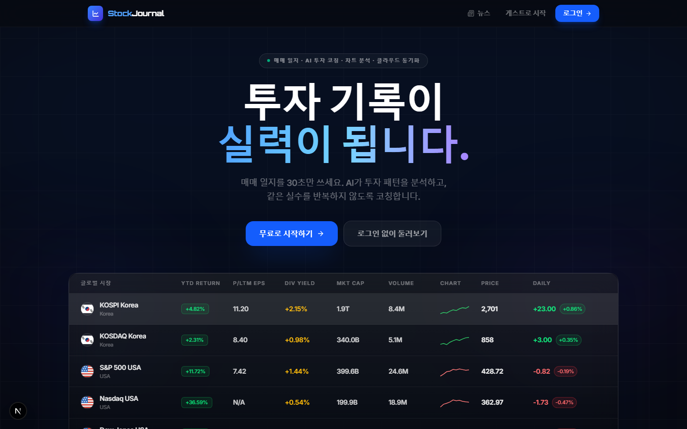
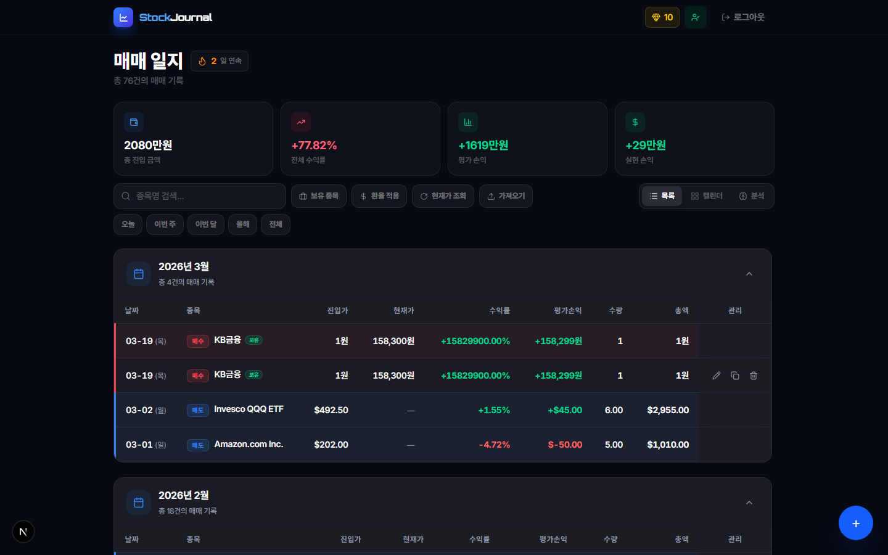
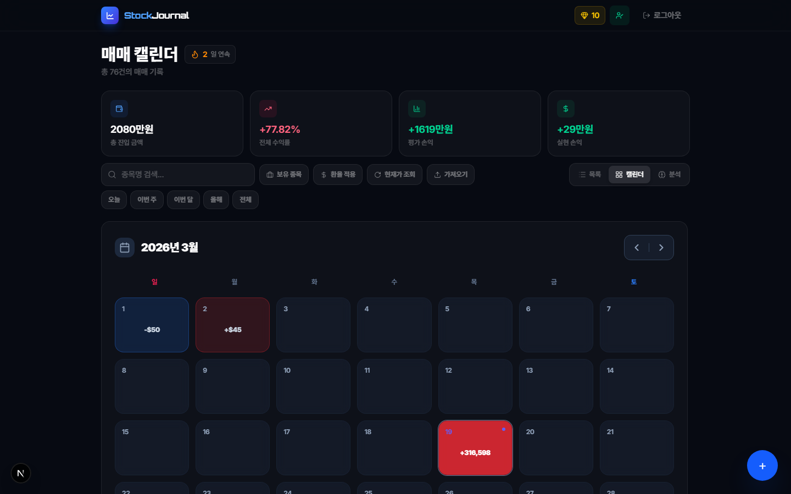
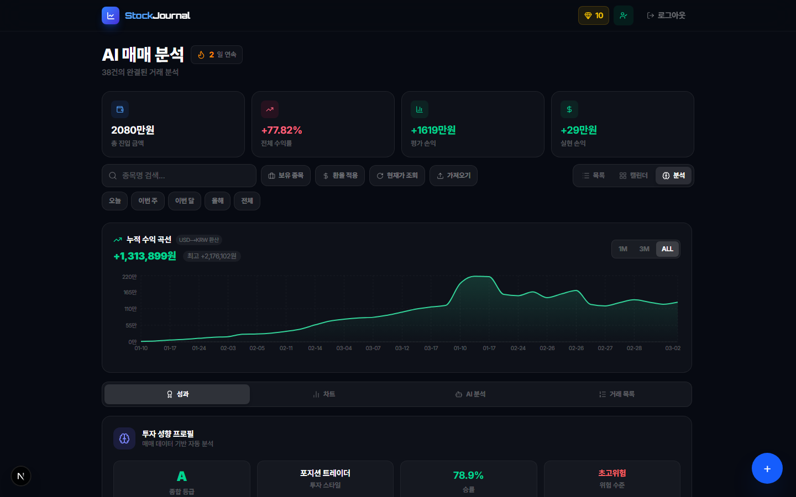
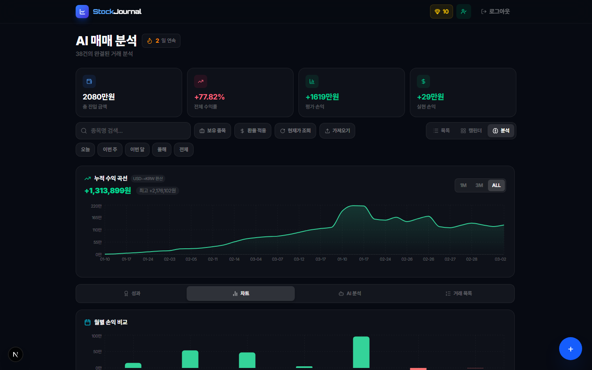
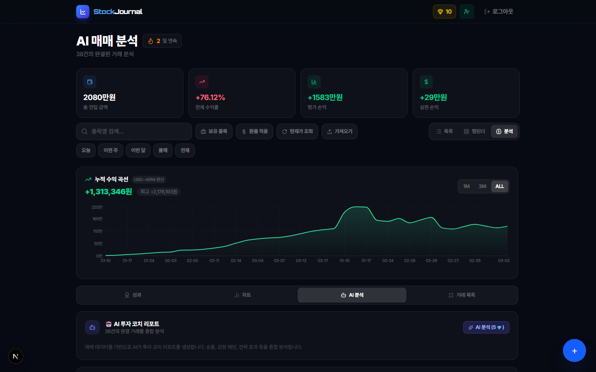
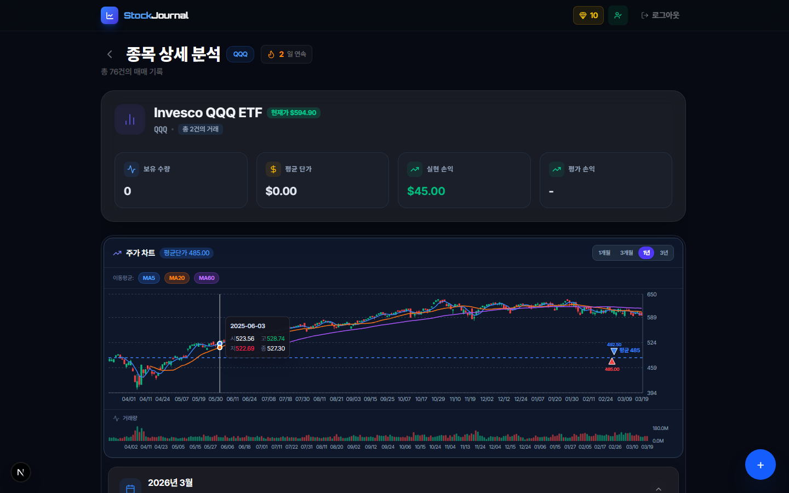
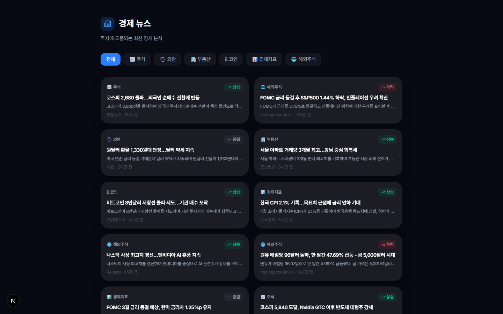

# Stock Journal

> 직관적인 매매일지로 시작하는 스마트한 주식 투자 관리

Stock Journal은 개인 투자자를 위한 매매 일지 애플리케이션입니다. 거래 기록, AI 기반 분석, 실시간 시세, 경제 뉴스, 트레이딩 도구를 한 곳에서 제공합니다.

[](https://nextjs.org/)
[](https://www.typescriptlang.org/)
[](https://supabase.com/)
[](https://tailwindcss.com/)

---

## 스크린샷

### 랜딩 페이지
실시간 글로벌 시장 시세 테이블과 주요 기능 소개


### 매매 일지
포트폴리오 요약(총 진입금액, 수익률, 평가손익, 실현손익)과 월별 거래 목록


### 캘린더 뷰
월간 P&L 히트맵 -- 날짜별 손익을 색상으로 한눈에 파악


### 분석 대시보드 - 성과
누적 수익 곡선, 투자 성향 프로필(종합 등급, 투자 스타일, 승률, 위험 수준)


### 분석 대시보드 - 차트
월별 손익 비교, 요일별 패턴, 감정별 수익률 등 다각적 분석


### AI 매매 분석
AI 투자 코치 리포트 -- 완결된 거래를 기반으로 승률, 감정 패턴, 전략 효과 등을 종합 분석


### 종목 상세 분석
종목별 보유 현황, 실현/평가 손익, 주가 차트(이동평균선, 거래량), 거래 내역


### 경제 뉴스
카테고리별(주식, 외환, 부동산, 코인, 경제지표, 해외주식) 최신 뉴스


---

## 주요 기능

### 매매 일지
- 매수/매도 거래를 간편하게 기록 (종목 자동 검색, 날짜, 가격, 수량)
- 심화 기록: 감정 태그, 매매 전략, 메모, 체크리스트
- 매매 템플릿으로 반복 거래를 빠르게 입력
- 월별 그룹핑, 기간 필터(오늘/이번 주/이번 달/올해/전체)
- 보유 종목 필터, 환율 적용, 현재가 조회
- JSON 파일 가져오기/내보내기

### 캘린더 뷰
- 월간 P&L 히트맵 (수익=초록, 손실=빨강)
- 날짜 클릭 시 해당일 거래 상세 패널
- 월별 네비게이션

### 분석 대시보드
- **성과 탭**: 누적 수익 곡선(1M/3M/ALL), 투자 성향 프로필, 종합 등급, 승률
- **차트 탭**: 월별 손익 비교, 요일별 패턴, 감정별 수익률, 종목별 분석
- **AI 분석 탭**: Google Gemini 기반 AI 분석 리포트
- **거래 목록 탭**: 라운드트립(매수-매도 매칭) 기반 완결된 거래 목록

### AI 코칭
- Google Gemini API를 활용한 주간 종합 리포트
- 개별 거래 AI 리뷰 (전략 평가, 개선 제안)
- AI 리포트 저장 및 히스토리 관리
- API 키 미설정 시 목(mock) 모드로 동작

### 경제 뉴스
- 주식, 외환, 부동산, 코인, 경제지표, 해외주식 카테고리
- 뉴스 요약과 시장 영향도 배지
- 상승/하락/중립 시장 영향 분석

### 트레이딩 도구 (로그인 없이 사용 가능)
- **리스크/리워드 계산기**: 매수가, 손절가, 목표가로 리스크 대비 수익 비율 분석
- **물타기 역산 계산기**: 목표 평단가에서 역산하여 필요한 추가 매수량과 투자금 산출
- **투자 복리 계산기**: 월 적립식 투자의 복리 효과를 연도별 차트로 확인
- **적정 매수량 계산기**: 계좌 리스크 비율에 따른 종목별 적정 수량 산출

### 코인 & 게이미피케이션
- 매일 로그인 시 코인 지급 (일일 보너스)
- 가입 보너스 코인
- AI 분석 등 프리미엄 기능에 코인 사용
- 코인 잔액 및 사용 내역 확인

### 연속 기록 (스트릭)
- 매매 기록 연속 일수 추적
- 주말 제외 연속일 계산
- 현재/최장 연속 기록 표시

### 온보딩 체크리스트
- 첫 거래 등록, 매수-매도 사이클 완성, 분석 방문, AI 리포트 확인
- 단계별 진행률 표시

### 다중 통화 지원
- KRW, USD 통화 자동 인식
- 실시간 환율 적용 및 통합 손익 계산 (USD to KRW 환산)
- 통화별 표시 전환

### 인증 & 데이터
- Supabase 인증: 이메일 로그인, 네이버 소셜 로그인
- 클라우드 동기화: 로그인 시 데이터 자동 저장
- 게스트 모드: 로그인 없이 로컬 스토리지에서 사용
- 게스트 -> 로그인 시 데이터 마이그레이션

---

## 시작하기

### 웹사이트 접속

**[www.매매일지.com](https://www.매매일지.com)** 에서 바로 사용할 수 있습니다.

- **로그인**: 이메일 또는 네이버 계정으로 로그인하여 클라우드에 데이터 동기화
- **게스트 모드**: 로그인 없이 바로 시작 (데이터는 브라우저에 저장)

### 로컬 개발

```bash
git clone https://github.com/yescjs/stock-journal.git
cd stock-journal
npm install
```

`.env.local` 파일에 환경 변수를 설정합니다:

```
NEXT_PUBLIC_SUPABASE_URL=
NEXT_PUBLIC_SUPABASE_ANON_KEY=
ALPHA_VANTAGE_API_KEY=
```

선택사항 (미설정 시 AI 분석은 목 모드로 동작):
```
GEMINI_API_KEY=
```

```bash
npm run dev       # 개발 서버 (http://localhost:3000)
npm run build     # 프로덕션 빌드
npm run lint      # ESLint 실행
```

---

## 기술 스택

| 영역 | 기술 |
|------|------|
| Framework | Next.js 16 (App Router) |
| Language | TypeScript 5 |
| Styling | Tailwind CSS 4 |
| UI | Lucide React, Framer Motion |
| Charts | Recharts |
| Auth & DB | Supabase (PostgreSQL) |
| AI | Google Gemini API |
| Stock Data | Alpha Vantage API, Yahoo Finance |
| Markdown | React Markdown + remark-gfm |

---

## 프로젝트 구조

```
stock-journal/
├── app/
│   ├── api/                        # API Routes
│   │   ├── ai-analysis/           # Google Gemini AI 분석
│   │   ├── auth/naver/            # 네이버 OAuth
│   │   ├── coins/                 # 코인 잔액/트랜잭션
│   │   ├── exchange-rate/         # USD/KRW 환율
│   │   ├── stock-chart/           # Yahoo Finance 차트 데이터
│   │   ├── stock-price/           # 현재 주가
│   │   └── stock-search/          # 종목 검색 (Alpha Vantage)
│   ├── components/
│   │   ├── charts/                # Recharts 차트 래퍼
│   │   ├── news/                  # 뉴스 카드, 카테고리 탭
│   │   ├── tools/                 # 트레이딩 도구 계산기
│   │   ├── ui/                    # 공통 UI (Button, Card 등)
│   │   └── views/                 # 페이지 뷰 (TradeListView, AnalysisDashboard)
│   ├── hooks/                     # 비즈니스 로직 훅
│   │   ├── useAIAnalysis.ts       # AI 분석 리포트
│   │   ├── useCoins.ts            # 코인 시스템
│   │   ├── useCurrentPrices.ts    # 실시간 주가
│   │   ├── useEventTracking.ts    # 이벤트 추적
│   │   ├── useExchangeRate.ts     # 환율
│   │   ├── useOnboarding.ts       # 온보딩 체크리스트
│   │   ├── useStreak.ts           # 연속 기록
│   │   ├── useSupabaseAuth.ts     # 인증
│   │   ├── useTradeAnalysis.ts    # 라운드트립 분석
│   │   ├── useTradeFilter.ts      # 필터/그룹핑
│   │   ├── useTradeTemplates.ts   # 매매 템플릿
│   │   └── useTrades.ts           # 거래 CRUD (하이브리드 스토리지)
│   ├── lib/                       # Supabase 클라이언트 등
│   ├── types/                     # TypeScript 타입 정의
│   ├── news/                      # 뉴스 페이지
│   ├── tools/                     # 트레이딩 도구 페이지
│   ├── trade/                     # 매매 일지 메인 페이지
│   └── page.tsx                   # 랜딩 페이지
├── public/                        # 정적 파일
└── supabase/migrations/           # DB 마이그레이션
```

---

## 문의 및 피드백

서비스 이용 중 문제가 발생하거나 개선 아이디어가 있으시면 [GitHub Issues](https://github.com/yescjs/stock-journal/issues)를 통해 알려주세요.
